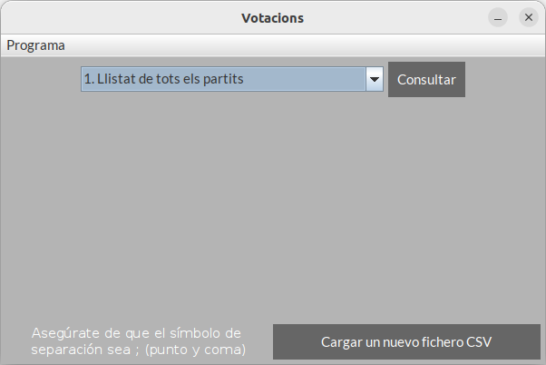
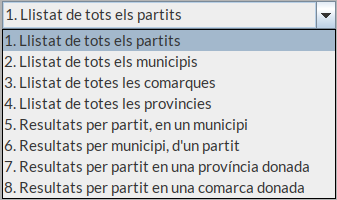
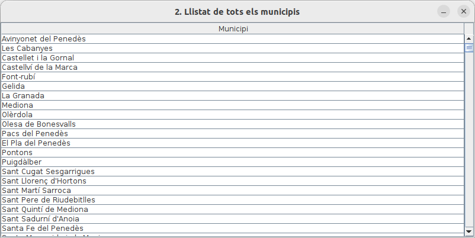
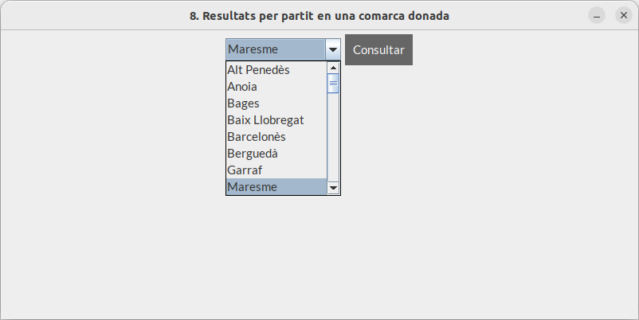
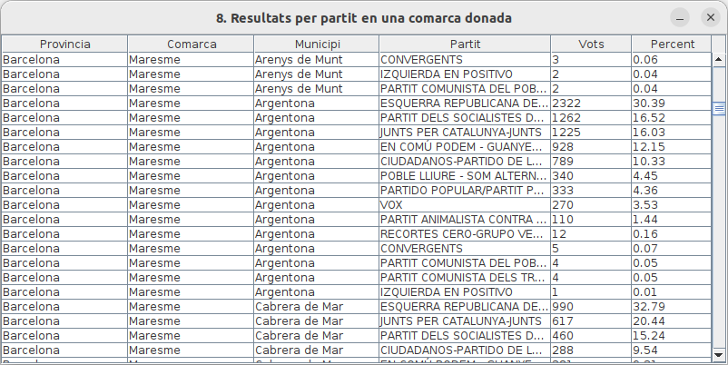
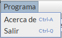
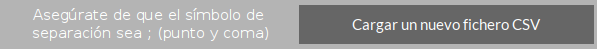
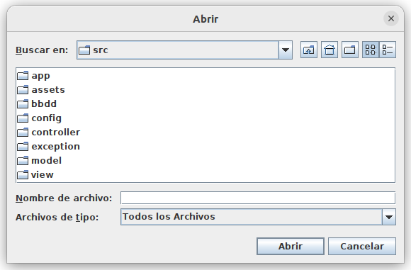
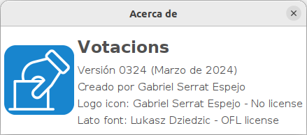

# Visualizador_Votaciones
App de mostrar resultados de votación a partir de un fichero CSV y base de datos DB4O utilizando patrón MVC y Singleton

## Descripcion

Una aplicación que permite mostrar los resultados de unas elecciones a partir de un fichero CSV.

El fichero de muestra pertenece a unas elecciones en Cataluña. [Enlace al fichero CSV](src/config/votacions.csv).

Se permite cargar otro fichero CSV al momento de abrir la aplicación.

Asegurarse que el fichero tenga como simbolo de separación **;** y contenga las siguientes columnas:

| PROVÍNCIA | COMARCA | MUNICIPI | SIGLES | PARTIT | VOTS | PERCENT |
|-----------|---------|----------|--------|--------|------|---------|
| String    | String  | String   | String | String | int  | float   |

Los datos del fichero CSV se guardan los objetos de negocio:

- [Provincia](src/model/Provincia.java) : columna PROVÍNCIA.
- [Comarca](src/model/Comarca.java) : columna COMARCA.
- [Municipi](src/model/Municipi.java) : columna MUNICIPI.
- [Partit](src/model/Parit.java) : columnas SIGLES y PARTIT.
- [Resultat](src/model/Resultat.java) : objetos anteriores más columnas VOTS y PERCENT.

Los objetos generados se guardan en un [fichero DB4O embedded](src/bbdd/myBbdd.db4o) utilizando la libreria adjunta [db4o-8.0.249.16098-all-java5.jar](db4o-8.0.249.16098-all-java5.jar).

Los objetos son leidos desde la base de datos DB40 y se guardan en colecciones LinkedHashSet para evitar mostrar datos duplicados.

La aplicación implementa el patrón MVC (Modelo, Vista y Controlador) y las llamadas de la base de datos las administra el modelo [ResultatModel](src/model/ResultatModel.java) que implementa patrón Singleton.

## Funcionamiento

### Ventana principal

La ventana principal dispone de 3 apartados interactivos:

#### Selección de datos a mostrar

Una lista con 8 opciones a mostrar *(en Catalan por ser elecciones Catalanas)*. Pulsa el boton **Consultar** para mostrar los datos. Hay 2 tipos de filtros diferentes:

- Listado *(Llistat en Catalan)* que abre una nueva ventana con una tabla de datos.
- Resultado *(Resultat en Catalan)* que abre una nueva ventana con otro selector y una tabla al pulsar **Consultar**.

*Ejemplo de la opción '2. Llistat de tots els municipis'*

*Ejemplo de la opción 8. Resultats per partit en una comarca donada*

#### Menu de navegación 'Programa'

Menú de navegación con 2 opciones:

- **Ctrl+A** : Abrir una venatana de Acerca del programa.
- **Ctrl+Q** : Cerrar la ventana.

#### Boton de cargar un nuevo fichero CSV

Permite la carga de otro fichero CSV. Los datos iniciales se reemplazan por los datos de este CSV. El formato debe ser indicado en **Descripción**.

### Ventana de Acerca de

Ventana de creditos del programa.

### Ventanas de mostrar listados y resultados

Cada opcion dispone de su propia ventana para mostrar los listados o resultados correspondientes.

## Agradecimientos

- **Votaciones (Logotipo)** : Creado por Gabriel Serrat Espejo (yo).
- **Lato Font** : Creado por [yPoland Lukasz Dziedzic](mailto:team@latofonts.com). [OFL License v1.1 (26/02/2007)](src/assets/lato/OFL.txt).
- **db4objets java plugin** : [Developer db4o](http://developer.db4o.com/), [GNU General Public License version 2.0 (GPLv2)](https://www.gnu.org/licenses/old-licenses/lgpl-2.0.html).
